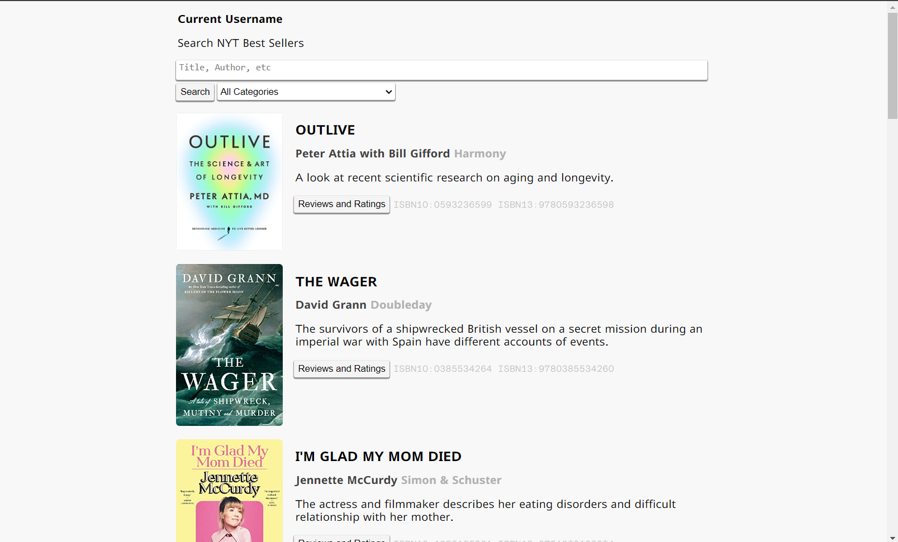

# nyt-book-viewer

Flask is used to serve all REST API requests, additionally it also serves the user interface.

All user data is stored on MongoDB Cloud Atlas and all book information is gathered from the NYT API. In order to run locally you need both a `mongo.key` and `nyt.key` file with their respective API keys in the `api` folder.

Created namely for CoSchedule Coding Challenge V3.

[View NYT Bestsellers on the Demo.](https://waveplatform.pythonanywhere.com/main/)

# API

Below is a short description of the API.

## Auth

**Signup**

`/api/signup/`

- `uname`: username
- `pword`: password

Returns with response relating whether there was a successful signup. Additionally, if a successful signup occured the user will atain an authentication key.

**Login**

`/api/login/`

- `uname`: username
- `pword`: password

Returns with response relating whether there was a successful login. Additionally, if a successful login occured the user will atain an authentication key.

## Explore

**Explore**

`/api/explore/`

- `page_number`: integer you are requesting
- `category`: category being requested

Returns with response relating whether addition of rating occured or not.

**Get Book**

`/api/getbook/`

- `isbn`: ISBN of book we're looking for

Get book information from ISBN from our database.

**Search**

`/api/search/`

- `searchterm`: some string that might work

Returns list of books

*VIDEO DEMO:*

## Review

**Rate**

`/api/rate/`

- `uname`: username
- `akey`: authentication key
- `isbn`: isbn number of book your review under it
- `review`: string with intended review in it
- `rating`: integer between 1 and 10

Returns with response relating whether addition of rating occured or not.

*VIDEO DEMO:*

**Delete Rating**

`/api/deleterating/`

- `uname`: username
- `akey`: authentication key
- `isbn`: isbn number of book your review under it

Returns with response relating whether deletion of rating occured or not.

*VIDEO DEMO:*

## Comment

**Comment**

`/api/comment/`

- `uname`: username
- `akey`: authentication key
- `isbn`: isbn number of book with comment of review under it
- `review_uname`: username of reviewer you commented under
- `comment`: comment content you are adding

Returns with response relating whether deletion occured or not.

*VIDEO DEMO:*

**Delete Comment**

`/api/deletecomment/`

- `uname`: username
- `akey`: authentication key
- `isbn`: isbn number of book with comment of review under it
- `review_uname`: username of reviewer you commented under
- `comment`: comment content you are deleting

Returns with response relating whether deletion occured or not.

*VIDEO DEMO:*

**Alter Comment**

`/api/altercomment/`

- `uname`: username
- `akey`: authentication key
- `isbn`: isbn number of book with comment of review under it
- `review_uname`: username of reviewer you commented under
- `comment`: comment content you are altering
- `updated_comment`: updated comment content you are altering too

Returns with response relating whether success occured or not.

## Other

**Ping**

`/api/ping/`

pong

# Setup

Setup the device by getting the respective api keys for your MongoDB Cloud Atlas database (`mongo.key`) and NYT Best Sellers API (`nyt.key`) and placing them into the `api` folder.

Ensure that MongoDB can connect to your service by adding the services IP address to the MongoDB Cloud Atlas Network Atlas list.

Run test environment (non-production) with `py -3 -m flask_app`. Or run in production with normal production setup process.

I currently have a slightly modified version of the flask code running on a premium PythonAnywhere account: [link to website](https://waveplatform.pythonanywhere.com/main/).

# TODO

## Basic

- [x] Create API
	- [x] End point username / password
	- [x] Allow searching the data source
	- [x] Allow rating system
		- [x] Add
		- [x] Delete
		- [x] View
		- [x] Edit
	- [x] Comment system
- [x] Create UI
	- [x] End point username / password
	- [x] Allow searching the data source
	- [x] Allow rating system
		- [x] Add
		- [x] Delete
		- [x] View
		- [x] Edit
	- [x] Comment system

## Extra

- [ ] API
  - [x] Cloud hosting
    - [x] MongoDB Cloud Atlas for Database
    - [x] PythonAnywhere for Flask Service
  - [ ] Optimization
- [ ] UI
  - [ ] Optimization
  - [ ] Better Styling
    - [ ] Search result [highlighting](https://stackoverflow.com/questions/32130130/how-to-highlight-all-occurrences-of-a-word-on-a-page-with-javascript-or-jquery) 
    - [ ] Dark theme switcher